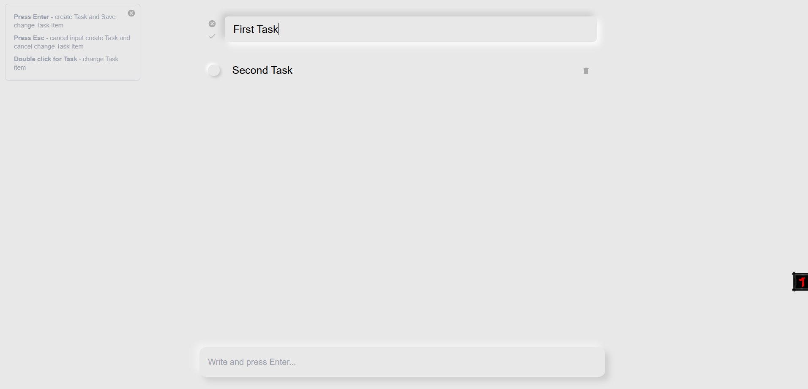

# To Do List

Со страхом и трепетом представляю свой To Do List. Да, все кому не лень это делают и я тоже решил хоть с чего-то начать.  
А почему бы и нет? :)

### React, TypeScript, Vite, Tailwind, MUI

Данный проект пощупать React, UI фреймворки. Поработать с локальным состоянием, пропсами.

В планах переписать под стейт менеджмент, например Redux, сохранять все в local storage, придумаь что-то с роутингом 
и возможно даже прикрутить к бэкенду, чтобы была учетка.

Пока приложение рассчитано для работы с декстопа, т.е. указатель должен быть мышка. Так как для тачпада надо продумать UI/UX.
<<<<<<< HEAD

=======

>>>>>>> 8edcd57b8b708c6f384be7a174cfde199900a185
